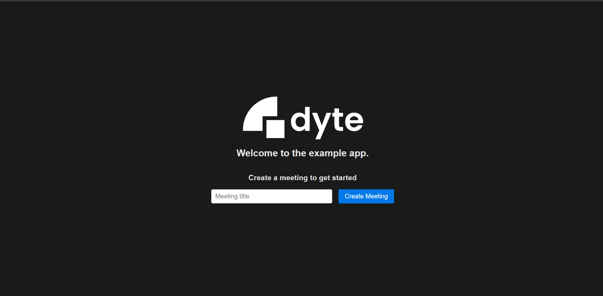

<!-- PROJECT LOGO -->
<p align="center">
  <a href="https://dyte.in">
    
  </a>

  <h3 align="center">Web integration Example</h3>

  <p align="center">
    A simple express app which integrates with dyte using REST APIs.
    <br />
    <a href="https://docs.dyte.in"><strong>Explore the docs »</strong></a>
    <br />
    <br />
    <a href="https://dyte-web-example.herokuapp.com/">View Demo</a>
    ·
    <a href="https://github.com/dyte-in/web-integration-example/issues">Report Bug</a>
    ·
    <a href="https://github.com/dyte-in/web-integration-example/issues">Request Feature</a>
  </p>
</p>


<!-- TABLE OF CONTENTS -->
## Table of Contents

* [About the Project](#about-the-project)
  * [Built With](#built-with)
* [Getting Started](#getting-started)
  * [Installation](#installation)
* [Usage](#usage)
* [License](#license)


<!-- ABOUT THE PROJECT -->
## About The Project

A basic express js project demonstrating how you can integrate your website with dyte.


It creates a new dyte meeting and then allows to join it as a participant or a host. A demo is hosted on https://dyte-web-example.herokuapp.com/

### Built With

* [express-generator](https://expressjs.com/en/starter/generator.html)
* [dyte-client](https://www.npmjs.com/package/dyte-client)
* [Pure CSS](https://purecss.io/)


<!-- GETTING STARTED -->
## Getting Started

Please make sure you have an organization ID and API Key for your application. These can be obtained from the developer portal.

### Installation
 
1. Clone the repo
```sh
git clone https://github.com/dyte-in/web-integration-example.git
```
2. Install NPM packages
```sh
npm install
```
3. Create an `.env` file with your credentials. Use `.env.example` as a template.
```sh
cp .env.example .env
nano .env
```
4. Run the application
```sh
npm start
```

<!-- USAGE EXAMPLES -->
## Usage

You can use this example as a reference on how you can integrate your webapp with dyte.

_For documentation on APIs and client SDKs, please refer to our [docs page](https://docs.dyte.in)._


<!-- LICENSE -->
## License

Distributed under the MIT License. See [`LICENSE`](./LICENSE) for more information.
